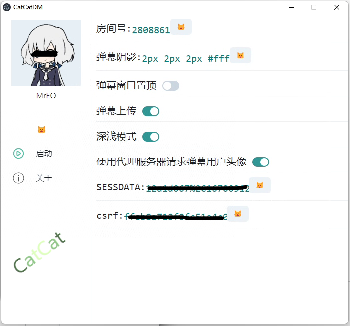
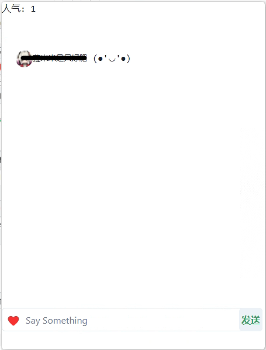

[](https://github.com/kokolokksk/catcat-dm-react/actions/workflows/publish.yml)
[](http://hits.dwyl.com/kokolokksk/catcat-dm-react)

# CatCatDM React


> CatCatDM! React!
> > 喵喵

### 说明
 哔哩哔哩直播 弹幕姬：
  查看直播间弹幕。

- 发送弹幕 与 修改 直播间标题 需要设置 ```SESSDATA```(```SESSDATA```) 与 ```csrf```(```bili_jct```)，登陆哔哩哔哩后 F12 复制cookies中的 ```SESSDATA``` 与 ```bili_jct``` 对应键值
- tts 需要Azure平台相应key
- 弹幕阴影建议设置值```1px 1px 1px  #fff``` 或者 ```1px 1px 1px  #000```
>应用界面
 - 
 - 

- [下载地址](https://github.com/kokolokksk/catcat-dm-react/releases/latest)

## Windows
- 在Windows 10/11 上测试
- 直接运行CatCatDM.exe

## Linux
~- 在Ubuntu 20.04 版本上测试。~ (尚未测试)
- 进入目录 ```chmod +x CatCatDM```
- 若提示  ```libgconf-2.so.4: cannot open shared object file: No such file or directory``` 则 ```apt-get update``` 再```apt-get install libgconf-2-4``` 然后执行 ```./CatCatDM```

#### 待做列表
- [x] 对接直播间
- [x] 自定义房间号
- [x] 显示弹幕
- [x] 人气
- [x] 弹幕本地保存
- [x] 修改直播间标题
- [x] sc显示
- [x] 主题切换
- [x] TTS欢迎礼物
- [x] TTS读弹幕
- [x] 进入直播间提示 
- [x] 礼物显示
- [x] 发送弹幕
- [x] 内置应用更新【仅exe版本】 
- [x] 使用更加好听的TTS


#### 下一步
- 直播间管理相关。

### 感谢（Thanks）
- npm module [electron-referer](https://github.com/akameco/electron-referer)
- npm module [bilibili-live-ws](https://github.com/simon300000/bilibili-live-ws/)
- npm module [bilibili-live-danmaku-api](https://github.com/simon300000/bilibili-live-danmaku-api)
- [background image](https://codepen.io/plavookac/pen/QMwObb)
- [tts间隔问题](https://stackoverflow.com/questions/62564402/microsoft-cognitive-tts-onaudioend-event-not-working)
- 感谢[jevanni](https://www.deviantart.com/jevanni/art/Miku-Hatsune-Vocaloid-111570363)的动图。
- [MistEO](https://github.com/MistEO)提出的bug
- [hongyizs](https://github.com/hongyizs)答疑
- generated from electron-react-boilerplate/electron-react-boilerplate

### 交流
issue 或者 神秘代码（319833969）

## Star History

[](https://star-history.com/#kokolokksk/catcat-dm-react&Date)

